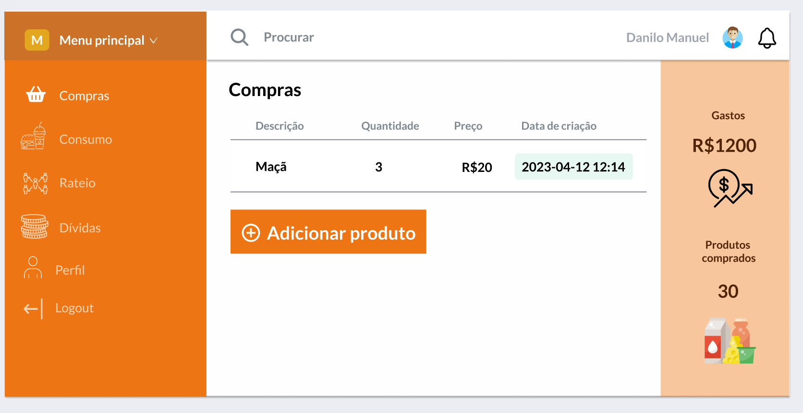

# Sistema de controle de gastos

 

  

  <h3 align="center">Controle de pagamento (tela do menu do aluno)</h3>

 
 

## Sobre o projeto

O sistema proposto permitirá o gerenciamento do estoque e do rateamemento
de todos produtos entre os alunos do NPI.

## Ferramentas usadas

*   PHP/Laravel
*   JavaScript
*   HTML
*   CSS
*   PostgreSQL

***
**No momento tem apenas o MVP do projeto pronto 😉**