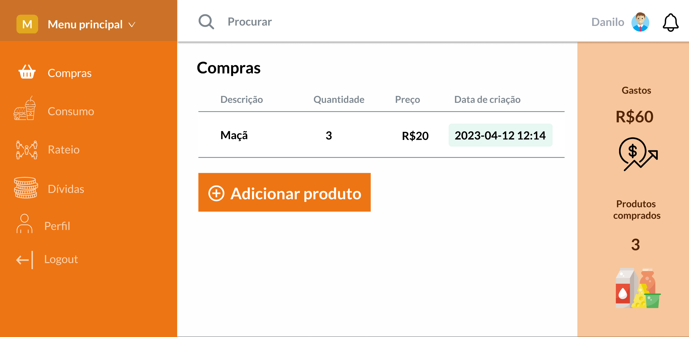
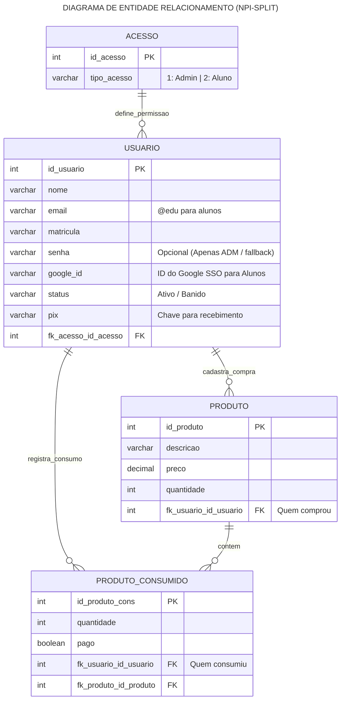

# NPI Split 

<div align="center">
  
</div>

<div align="center">
  
  
  
</div>

## 📌 Sobre o Projeto

O **NPI Split** é uma plataforma de gestão inteligente de estoque e rateio de custos desenvolvida para o ecossistema do Núcleo de Práticas de Informática (NPI) na UniFil. 

O sistema resolve problemas de logística e transparência financeira em compras coletivas (a famosa "vaquinha" do laboratório). Ele permite que os usuários cadastrem produtos comprados, controlem o consumo individual e automatizem o cálculo de divisão de preços (rateio). Com geração de relatórios e monitoramento de status de pagamento, o projeto garante que a convivência seja organizada, justa e livre de inadimplência.

## 🚀 Funcionalidades

O sistema possui dois níveis de acesso (Aluno e Administrador), oferecendo:

*   **Controle de Compras:** Registro de entrada de produtos, valores pagos e responsáveis pela compra.
*   **Controle de Consumo:** Rastreamento exato do que cada usuário consumiu.
*   **Rateio Automatizado:** Cálculo inteligente e automático de quanto cada usuário deve, baseado no seu consumo e no valor dos produtos.
*   **Autenticação Integrada:** Login via Google SSO (exclusivo para e-mails acadêmicos `@edu`).
*   **Gestão de Dívidas:** Acompanhamento de pagamentos integrados com chaves PIX.
*   **Relatórios em PDF:** Geração de relatórios detalhados de produtos, usuários, dívidas e rateio (exclusivo para Administradores).


## 🛠️ Tecnologias Utilizadas

*   **Backend:** PHP / Laravel
*   **Frontend:** JavaScript, HTML, CSS, Blade Templates
*   **Banco de Dados:** PostgreSQL
*   **Modelagem:** Diagramas UML (PlantUML) e Mermaid

## 🗄️ Modelagem do Banco de Dados

A arquitetura foi desenhada para separar claramente o que é comprado do que é consumido, garantindo relatórios precisos. As principais tabelas incluem:
*   `USUARIO` e `ACESSO` (Gestão de perfis e níveis de privilégio)
*   `PRODUTO` (Estoque de entrada/compras)
*   `PRODUTO_CONS` (Registro de saída/consumo)



## ⚙️ Como executar o projeto localmente

1. Clone o repositório:
   ```bash
   git clone https://github.com/Korzre/npi-split.git 
   ```

2. Instale as dependências do PHP:
   ```
   composer install
   ```

3. Instale as dependências do frontend:
    ```
   npm install && npm run dev
   ```

4. Configure o arquivo .env com suas credenciais do PostgreSQL e chaves de API do Google.

5. Rode as migrations para criar o banco de dados:
   ```
   php artisan migrate
   ```

6. Inicie o servidor local:
   ```
   php artisan serve
   ```

  