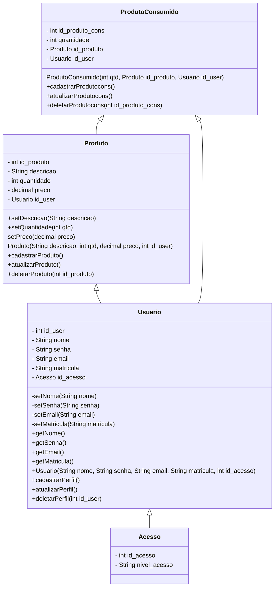

```mermaid

---
title:Diagrama de Classe
---
classDiagram
    class Acesso{
        - int id_acesso
        - String nivel_acesso
    }
    
    class Usuario{
        - int id_user 
        - String nome
        - String senha
        - String email
        - String matricula 
        - Acesso id_acesso

        -setNome(String nome)
        -setSenha(String senha)
        -setEmail(String email)
        -setMatricula(String matricula)

        +getNome()
        +getSenha()
        +getEmail()
        +getMatricula()

        +Usuario(String nome, String senha, String email, String matricula, int id_acesso)  
        +cadastrarPerfil()
        +atualizarPerfil()
        +deletarPerfil(int id_user)
    }

    Usuario <|-- Acesso
    Produto <|-- Usuario

    ProdutoConsumido <|-- Produto

    ProdutoConsumido <|-- Usuario

    class Produto{
        - int id_produto
        - String descricao
        - int quantidade
        - decimal preco
        - Usuario id_user

        +setDescricao(String descricao)
        +setQuantidade(int qtd)
        setPreco(decimal preco)

        Produto(String descricao, int qtd, decimal preco, int id_user)


        +cadastrarProduto()
        +atualizarProduto()
        +deletarProduto(int id_produto)

    }
    
    class ProdutoConsumido{
        - int id_produto_cons
        - int quantidade
        - Produto id_produto
        - Usuario id_user

        ProdutoConsumido(int qtd, Produto id_produto, Usuario id_user)
        +cadastrarProdutocons()
        +atualizarProdutocons()
        +deletarProdutocons(int id_produto_cons)
    }


```