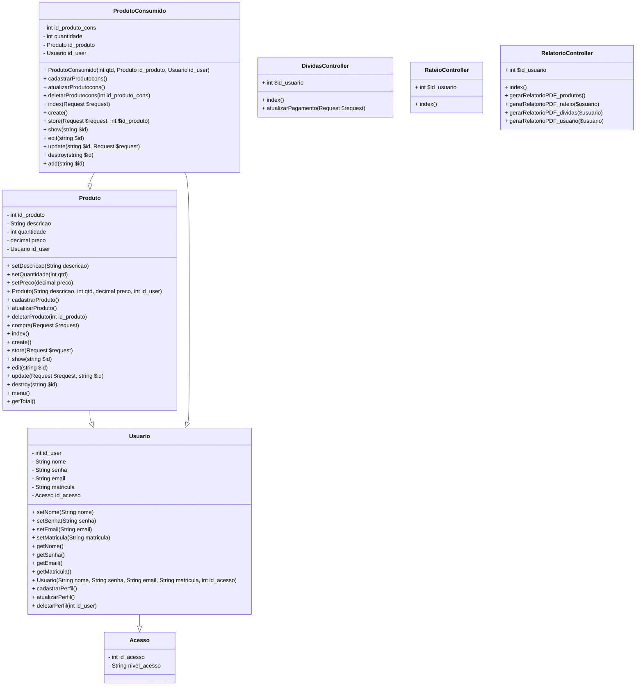

```mermaid

classDiagram
    class Acesso {
        - int id_acesso
        - String nivel_acesso
    }

    class Usuario {
        - int id_user 
        - String nome
        - String senha
        - String email
        - String matricula 
        - Acesso id_acesso

        + setNome(String nome)
        + setSenha(String senha)
        + setEmail(String email)
        + setMatricula(String matricula)
        + getNome()
        + getSenha()
        + getEmail()
        + getMatricula()
        + Usuario(String nome, String senha, String email, String matricula, int id_acesso)  
        + cadastrarPerfil()
        + atualizarPerfil()
        + deletarPerfil(int id_user)
    }

    class Produto {
        - int id_produto
        - String descricao
        - int quantidade
        - decimal preco
        - Usuario id_user

        + setDescricao(String descricao)
        + setQuantidade(int qtd)
        + setPreco(decimal preco)
        + Produto(String descricao, int qtd, decimal preco, int id_user)
        + cadastrarProduto()
        + atualizarProduto()
        + deletarProduto(int id_produto)
        + compra(Request $request)
        + index()
        + create()
        + store(Request $request)
        + show(string $id)
        + edit(string $id)
        + update(Request $request, string $id)
        + destroy(string $id)
        + menu()
        + getTotal()
    }

    class ProdutoConsumido {
        - int id_produto_cons
        - int quantidade
        - Produto id_produto
        - Usuario id_user

        + ProdutoConsumido(int qtd, Produto id_produto, Usuario id_user)
        + cadastrarProdutocons()
        + atualizarProdutocons()
        + deletarProdutocons(int id_produto_cons)
        + index(Request $request)
        + create()
        + store(Request $request, int $id_produto)
        + show(string $id)
        + edit(string $id)
        + update(string $id, Request $request)
        + destroy(string $id)
        + add(string $id)
    }

    class DividasController {
        + int $id_usuario
        + index()
        + atualizarPagamento(Request $request)
    }

    class RateioController {
        + int $id_usuario
        + index()
    }

    class RelatorioController {
        + int $id_usuario
        + index()
        + gerarRelatorioPDF_produtos()
        + gerarRelatorioPDF_rateio($usuario)
        + gerarRelatorioPDF_dividas($usuario)
        + gerarRelatorioPDF_usuario($usuario)
    }

    Usuario --|> Acesso
    Produto --|> Usuario
    ProdutoConsumido --|> Produto
    ProdutoConsumido --|> Usuario

```