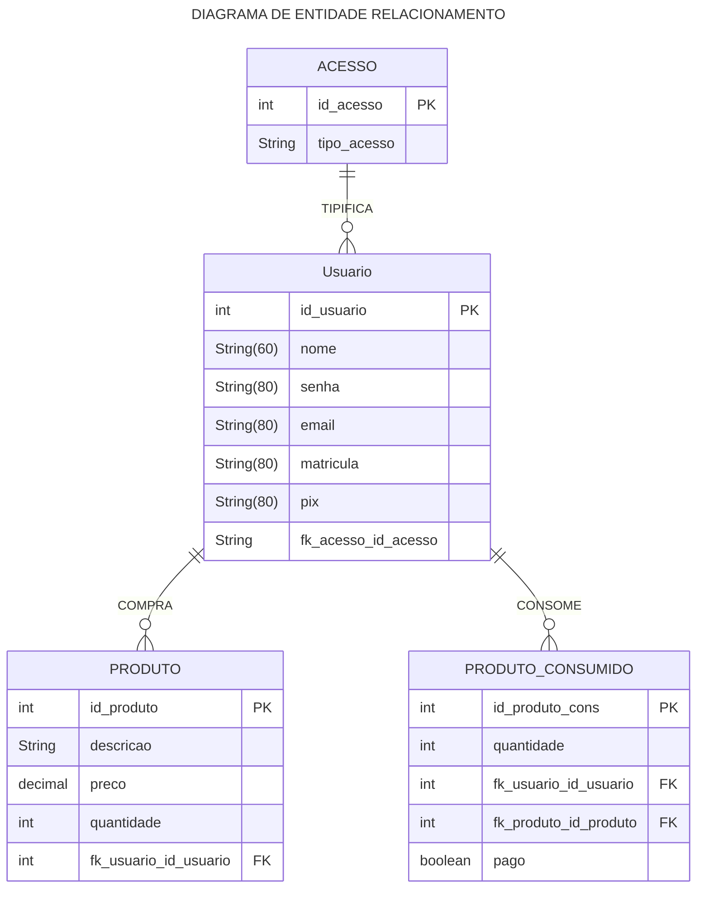

```mermaid
---
title: DIAGRAMA DE ENTIDADE RELACIONAMENTO
---
erDiagram

 ACESSO ||--o{ Usuario: TIPIFICA

ACESSO{
   int id_acesso PK
   String tipo_acesso
}
 
 Usuario ||--o{ PRODUTO : COMPRA 
 Usuario{
   int id_usuario PK
   String(60) nome
   String(80) senha
   String(80) email
   String(80) matricula
   String(80) pix   
   String fk_acesso_id_acesso  
 }

  Usuario ||--o{ PRODUTO_CONSUMIDO : CONSOME

  PRODUTO{
   int id_produto PK
   String descricao
   decimal preco
   int quantidade
   int fk_usuario_id_usuario FK
  }

  PRODUTO_CONSUMIDO{
   int id_produto_cons PK  
   int quantidade
   int fk_usuario_id_usuario FK
   int fk_produto_id_produto FK
   boolean pago
  }

```
