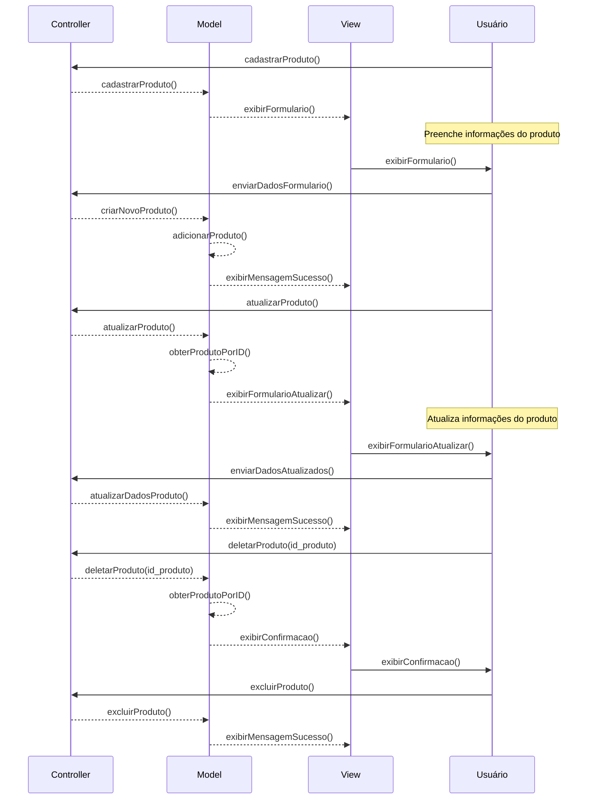

```mermaid
sequenceDiagram
    participant Controller
    participant Model
    participant View
    participant Usuário

    Usuário->>Controller: cadastrarProduto()

    Controller-->>Model: cadastrarProduto()

    Model-->>View: exibirFormulario()

    Note over Usuário: Preenche informações do produto

    View->>Usuário: exibirFormulario()

    Usuário->>Controller: enviarDadosFormulario()

    Controller-->>Model: criarNovoProduto()

    Model-->>Model: adicionarProduto()

    Model-->>View: exibirMensagemSucesso()

    Usuário->>Controller: atualizarProduto()

    Controller-->>Model: atualizarProduto()

    Model-->>Model: obterProdutoPorID()

    Model-->>View: exibirFormularioAtualizar()

    Note over Usuário: Atualiza informações do produto
    View->>Usuário: exibirFormularioAtualizar()

    Usuário->>Controller: enviarDadosAtualizados()

    Controller-->>Model: atualizarDadosProduto()

    Model-->>View: exibirMensagemSucesso()

    Usuário->>Controller: deletarProduto(id_produto)

    Controller-->>Model: deletarProduto(id_produto)

    Model-->>Model: obterProdutoPorID()

    Model-->>View: exibirConfirmacao()

    View->>Usuário: exibirConfirmacao()

    Usuário->>Controller: excluirProduto()

    Controller-->>Model: excluirProduto()

    Model-->>View: exibirMensagemSucesso()


```