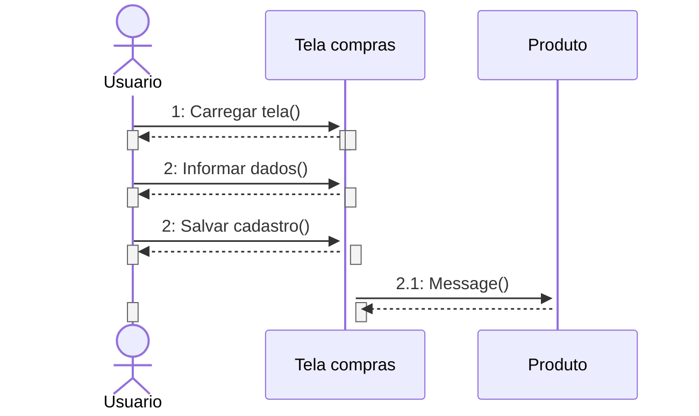

```mermaid
sequenceDiagram

    actor U as Usuario

    participant tela_comp as Tela compras

    participant Produto

    U ->>+tela_comp: 1: Carregar tela()
    activate tela_comp
    activate U

    tela_comp -->>-U: 
    deactivate tela_comp
    deactivate U

    

    U ->>+tela_comp: 2: Informar dados()
    activate tela_comp
    activate U
    tela_comp -->> U: 
    deactivate tela_comp
    deactivate U

    U ->>+tela_comp: 2: Salvar cadastro()
    activate tela_comp
    activate U
    tela_comp -->> U: 
    deactivate tela_comp
    deactivate U

    tela_comp->>+Produto: 2.1: Message()
    activate tela_comp
    activate U
    Produto -->>+tela_comp: 
    deactivate tela_comp
    deactivate U
    

```