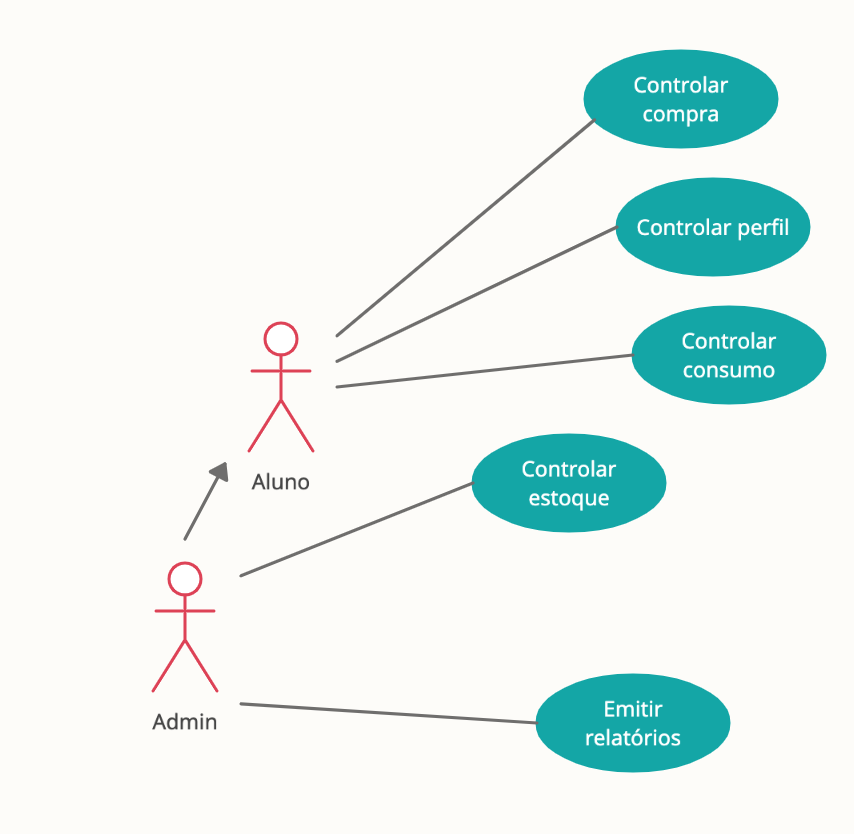

# Docs 📄

## Descrição

---

### Aluno
O aluno (ator) é o usuário comum, terá funções para controlar todos os produtos usados e comprados por ele.

### Admin 
O administrador (ator) é um usuário especial, ele terá o controle de todo o estoque e poderá fazer relatórios.

<b>Obs: O Adm consegue fazer todas as funções do aluno</b>

### Controlar estoque

Esse (RFN) tem o controle de todo o estoque, de todos os produtos, os usuários que compraram e os consumidosm, ele é acessado somente pelo administrador

### Controlar consumo

Esse (RFN) tem o controle dos produtos que foram usados

### Controlar perfil
Esse (RFN) tem o controle dos dados do perfil

### Controlar Compra

Esse (RFN) tem o controle da entrada (compra) dos produtos por parte do usuário

### Emitir relatórios

Esse (RFN) trata da emissão de todos os relatórios do sistema

* Relatório dos produtos
* Relatório de cada usuário
* Relatório semanal
* Relatório anual
* Gráficos dos produtos mais consumidos
* Relatórios personalizados

* ...

---

**⚠️ Na 📁 Diagrams tem todos os diagramas do projeto. ⚠️**