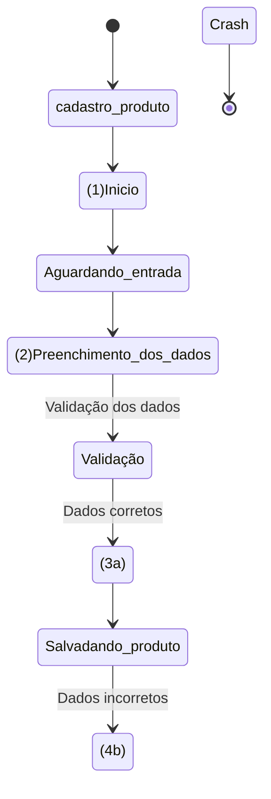

```mermaid
stateDiagram
    [*] --> cadastro_produto

    cadastro_produto --> (1)Inicio
    
    (1)Inicio --> Aguardando_entrada

    Aguardando_entrada --> (2)Preenchimento_dos_dados   

    (2)Preenchimento_dos_dados --> Validação: Validação dos dados

    Validação --> (3a): Dados corretos


    (3a) --> Salvadando_produto

    Salvadando_produto --> (4b):Dados incorretos


    Crash --> [*]
```